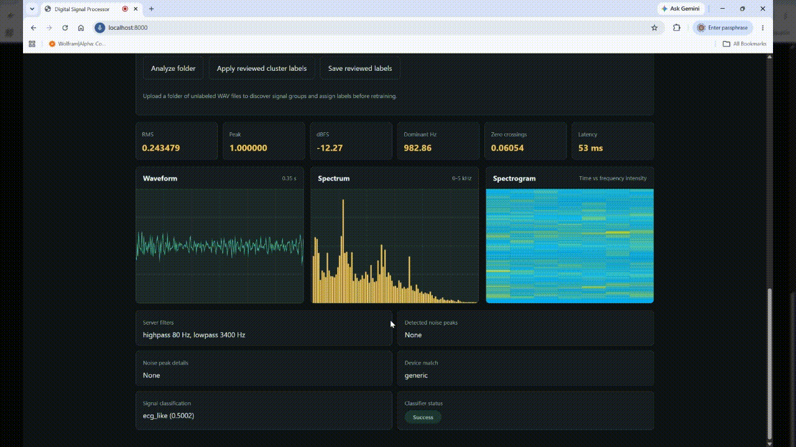

# Signal Processor

## Overview

Signal Processor is a digital signal processing project that connects offline audio analysis, a live browser microphone demo, and an Arduino-oriented embedded implementation.

The project is split into two connected parts:

- [Digital](Digital), a Python prototype for WAV inspection, FFT analysis, filtering, denoising experiments, and a browser-based microphone processing endpoint
- [Hardware](Hardware), an Arduino-oriented implementation for running a simplified signal-cleaning pipeline on embedded hardware

The goal is to prototype the DSP pipeline in software first, learn what kinds of noise are present in real recordings, visualize the results, and then carry the useful cleanup path onto hardware.

## What This Project Shows

- A Python DSP pipeline for inspecting, filtering, and cleaning WAV signals
- A live client/server website that captures microphone audio in the browser and sends chunks to Python for processing
- Real-time metrics including RMS, peak amplitude, dBFS, dominant frequency, zero-crossing rate, detected noise peaks, waveform, and spectrum
- A lightweight supervised classifier for noise, speech-like, and ECG-like signal labels
- A low-data training workflow that accepts labeled examples or reviewed unlabeled WAV batches without blindly training on unlabeled data
- An Arduino-compatible signal processor that applies embedded-friendly filtering and noise suppression
- Benchmarks for both WAV denoising quality and embedded per-sample timing

## Project Split

### Digital

The `Digital` folder is the analysis, prototyping, and web-demo side of the project. It is used to:

- load and inspect sample WAV files
- generate synthetic test signals
- analyze signals in the time and frequency domains
- apply high-pass, low-pass, band-pass, and notch filters
- detect prominent noise peaks
- test denoising ideas before moving them to hardware
- save cleaned output files for comparison
- run a local website that processes microphone input through the Python backend

This side of the repo is where filter settings are explored, measured, and visualized.

### Hardware

The `Hardware` folder is the embedded side of the project. It is used to:

- process live samples from a microphone or sensor
- subtract optional microphone-noise and sensor-noise reference inputs
- reduce random noise on-device
- run a hardware-friendly cleanup chain with DC removal, filtering, notch suppression, smoothing, and gating
- provide an Arduino sketch and reusable signal processor implementation

This side is not a direct port of the Python stack. It is a practical embedded implementation built from the lessons learned in `Digital`.

## Current Capabilities

### Digital Capabilities

- `SignalProcessor` class for core DSP operations
- FFT-based spectrum inspection
- time-domain and frequency-domain plotting
- synthetic sine and noisy signal generation
- WAV loading and saving
- sample pipelines for inspecting and cleaning recorded files
- live browser microphone capture through the Web Audio API
- Python HTTP endpoints for processing, classification, and retraining
- ML classifier with saved model state in `Digital/signal_classifier.pkl`
- browser-based labeling and review flow for unlabeled WAV clusters
- dashboard metrics and canvas-based waveform/spectrum visualization

### Hardware Capabilities

- reusable Arduino-compatible signal processor implementation
- support for:
  - main signal input
  - microphone noise reference input
  - sensor noise reference input
  - random-noise estimate input
- filtering stages suitable for embedded use
- serial benchmark sketch for timing the processor on-device

## What We Used

### Python and DSP

- Python
- `numpy` for signal arrays, FFTs, RMS, waveform reduction, and metric calculations
- `scipy.signal` for Butterworth filters, notch filters, Welch PSD analysis, and peak detection
- `matplotlib` for offline time-domain and frequency-domain plots
- `soundfile` for reading and writing WAV files

### Browser Client

- HTML, CSS, and JavaScript
- Web Audio API for microphone capture
- `fetch` for client/server communication
- Canvas rendering for waveform and frequency-spectrum views

### Server

- FastAPI backend serving the browser UI and API
- JSON API endpoints:
  - `/api/health` for service status
  - `/api/process` for DSP processing + classification
  - `/api/classify` for standalone ML signal classification
  - `/api/train` for labeled example retraining
  - `/api/train-directory` for labeled WAV/file batches
  - `/api/save-reviewed-labels` for reviewed unlabeled cluster assignments
- Base64 float32 audio transport from browser to backend
- Signal type hint support for `generic`, `speech`, `ecg`, and `other`
- Model persistence to `Digital/signal_classifier.pkl` after training

### MLOps and testing

- `requirements.txt` includes `pytest` for automated validation
- `tests/test_api.py` validates `/api/health`, `/api/process`, `/api/classify`, `/api/train`, and `/api/train-directory`
- GitHub Actions workflow added at `.github/workflows/ci.yml`
  - installs dependencies
  - launches the FastAPI server
  - runs API tests

### Hardware

- Arduino C++
- `.ino` sketch entry points
- reusable `SignalProcessor.h` and `SignalProcessor.cpp`
- serial output for embedded timing benchmarks

## Repository Layout

```text
SignalProcessor/
|
+-- Digital/
|   +-- core/
|   |   +-- __init__.py
|   |   +-- signal_processor.py
|   +-- io/
|   |   +-- __init__.py
|   |   +-- file_loader.py
|   |   +-- file_saver.py
|   |   +-- signal_generator.py
|   +-- example/
|   |   +-- benchmark_wavs.py
|   |   +-- sample_pipeline.py
|   |   +-- sample_pipeline2.py
|   +-- website/
|   |   +-- index.html
|   |   +-- app.js
|   |   +-- styles.css
|   +-- ml_model.py
|   +-- signal_classifier.pkl
|   +-- sample_files/
|   +-- processed_files/
|   +-- web_server.py
|
+-- Hardware/
|   +-- ArduinoBenchmark.ino
|   +-- ArduinoSignalProcessor.ino
|   +-- SignalProcessor.h
|   +-- SignalProcessor.cpp
|   +-- README.md
|
+-- tests/
|   +-- test_api.py
|
+-- README.md
|   +-- requirements.txt
```

## How The Pieces Work Together

The current workflow is:

1. Use `Digital` to inspect sample files and identify what noise is actually present.
2. Tune filtering and denoising behavior in Python where iteration is faster.
3. Use the browser app or API to process microphone or WAV samples and ask for classification.
4. Add labeled examples to retrain the model with real data when you have enough examples.
5. For smaller or unlabeled datasets, review cluster outputs and save reviewed labels before retraining.
6. Recreate the useful parts of the pipeline in `Hardware` using embedded-friendly code.
7. Deploy the hardware version to a board for live signal cleanup.

## Live Website Demo

The browser demo runs through the FastAPI app in `Digital/web_server.py` and serves the UI from the repo root.



Start the server from the repository root with:

```powershell
pip install -r requirements.txt
python -m uvicorn Digital.web_server:app --host 127.0.0.1 --port 8000
```

Open:

```text
http://127.0.0.1:8000
```

The current browser UI supports:

- microphone capture and signal processing
- WAV upload and batch example loading
- signal classification
- training examples with labels
- directory-style training for labeled WAV batches
- unlabeled folder analysis with cluster review
- saving reviewed cluster labels before retraining

The core API endpoints are:

```text
GET /api/health
POST /api/process
POST /api/classify
POST /api/train
POST /api/train-directory
POST /api/save-reviewed-labels
```

Example request shape for processing:

```json
{
  "sampleRate": 48000,
  "signalType": "generic",
  "samples": "<base64 float32 audio buffer>",
  "settings": {
    "highpass": 80,
    "lowpass": 3400,
    "detectNoise": true
  }
}
```

Example request shape for training:

```json
{
  "examples": [
    {"sampleRate": 48000, "samples": "<base64 float32 audio buffer>", "label": "speech_like"},
    {"sampleRate": 48000, "samples": "<base64 float32 audio buffer>", "label": "noise"}
  ]
}
```

The endpoints return processed metrics, classification results, and training summaries. The model is saved to `Digital/signal_classifier.pkl` after retraining.

## Digital Usage

The Python side depends on packages such as `numpy`, `scipy`, `matplotlib`, and `soundfile`.

Example workflow:

```python
from Digital.core.signal_processor import SignalProcessor
from Digital.io.signal_generator import generate_noisy_signal

sample_rate = 1000
duration = 2

signal = generate_noisy_signal(freq=50, duration=duration, sample_rate=sample_rate)
processor = SignalProcessor(signal, sample_rate)

processor.apply_lowpass(100)
processor.apply_highpass(10)
processor.normalize()
processor.plot_time_domain()
processor.plot_frequency_domain()
```

For recorded files, the sample pipeline in [sample_pipeline2.py](Digital/example/sample_pipeline2.py) inspects the WAV files in `Digital/sample_files` and writes cleaned output into `Digital/processed_files`.

Run it from the repository root with:

```powershell
$env:PYTHONPATH='C:\Users\Gculb\Desktop\SignalProcessor'
python Digital\example\sample_pipeline2.py
```

## Hardware Usage

The Arduino-facing implementation lives in:

- [ArduinoSignalProcessor.ino](Hardware/ArduinoSignalProcessor.ino)
- [SignalProcessor.h](Hardware/SignalProcessor.h)
- [SignalProcessor.cpp](Hardware/SignalProcessor.cpp)

The embedded processor is designed for real-time use and accepts:

- the main sample
- optional microphone noise reference
- optional sensor noise reference
- optional random-noise estimate

This makes the hardware implementation suitable for live microphone-plus-sensor setups where noise can come from multiple sources.

## Benchmarks

### WAV Benchmark

The Python benchmark script lives at [benchmark_wavs.py](Digital/example/benchmark_wavs.py).

Run it with:

```powershell
$env:PYTHONPATH='C:\Users\Gculb\Desktop\SignalProcessor'
python Digital\example\benchmark_wavs.py
```

Current measured results from the cleaned sample files:

- `M1F1-Alaw-AFsp.wav`: `+4.93 dB` speech-to-low-noise improvement and `+0.98 dB` estimated noise-floor improvement
- `M1F1-AlawWE-AFsp.wav`: `+4.93 dB` speech-to-low-noise improvement and `+0.98 dB` estimated noise-floor improvement
- `6_Channel_ID.wav`: `+1.25 dB` speech-to-low-noise improvement after channel selection and cleanup

These numbers come from comparing the original WAV files in `Digital/sample_files` against the cleaned outputs in `Digital/processed_files`.

### Arduino Benchmark

The hardware timing benchmark lives at [ArduinoBenchmark.ino](Hardware/ArduinoBenchmark.ino).

It measures:

- average processing time per sample
- max processing time per sample
- per-sample timing budget at the target sample rate
- estimated CPU usage at the configured sample rate

Upload the sketch to your board and open the serial monitor at `115200` baud to capture hardware timing results.

## Resume Bullets

- Built a two-stage DSP system in Python and Arduino C++ that analyzed recorded WAV files offline and translated the resulting denoising pipeline into an embedded real-time signal processor.
- Developed a browser-based microphone dashboard that streams live audio chunks to a Python server and displays RMS, dBFS, dominant-frequency, waveform, spectrum, and detected-noise metrics.
- Developed a modular signal-processing pipeline with FFT analysis, high-pass/low-pass/notch filtering, channel selection, and noise-reference subtraction for microphone and sensor inputs.
- Benchmarked denoising performance on real sample recordings, improving speech-to-low-noise ratio by up to `4.93 dB` and reducing estimated noise floor by about `0.98 dB` on 8 kHz A-law speech samples.
- Implemented an Arduino-compatible hardware pipeline with DC offset removal, noise gating, smoothing, and reference-based noise suppression, plus a serial benchmark for measuring per-sample processing cost on-device.

## Goals

- improve the digital analysis pipeline so it better identifies useful signal versus noise
- continue tuning the hardware pipeline based on real recordings
- support continuous live signal processing and frequency tracking
- strengthen the bridge between offline WAV analysis, browser-based microphone testing, and real-time embedded deployment

## License

MIT License.
